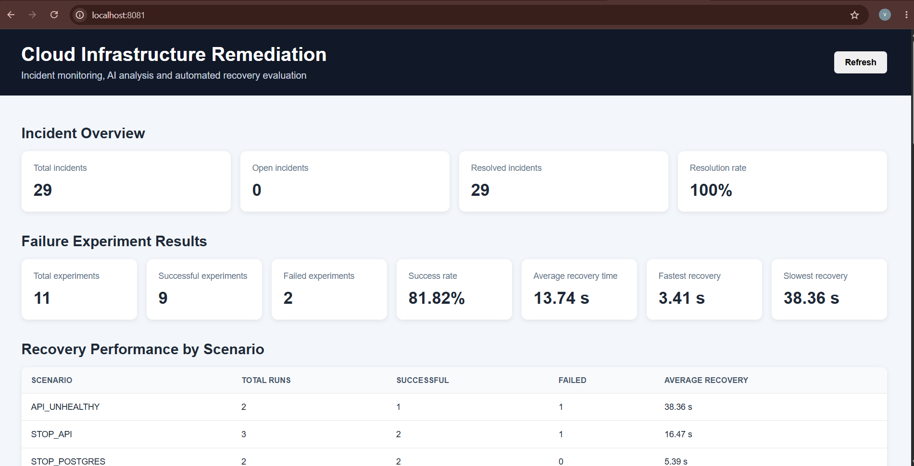
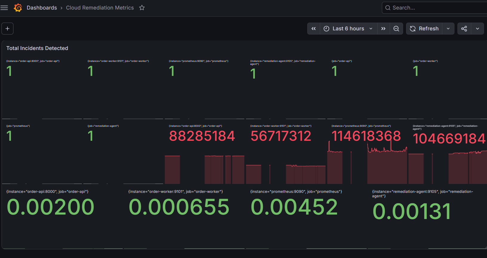
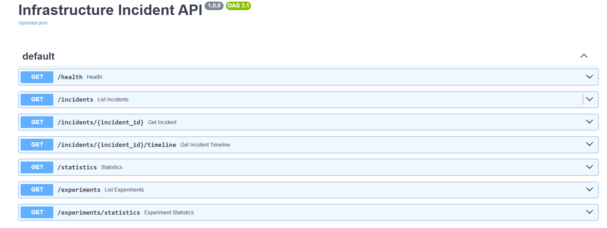
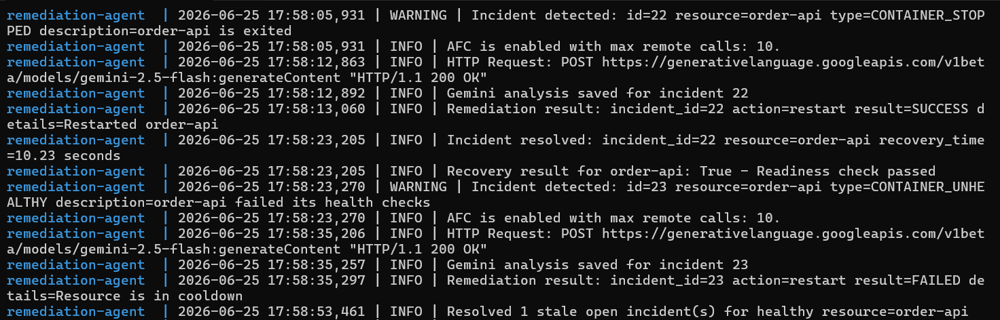
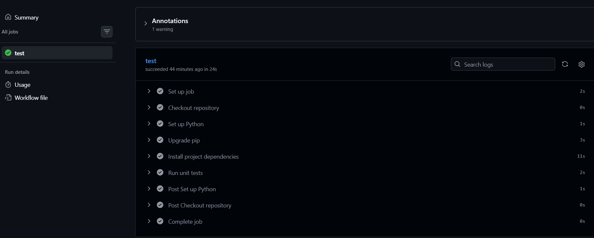

# Cloud Infrastructure AI Remediation Agent

A cloud infrastructure monitoring and remediation system that detects service failures, analyzes incidents using Gemini, performs controlled recovery actions, verifies recovery, and stores incident history for analysis.

The project currently runs on a local Docker-based environment and demonstrates how infrastructure failures can be detected and remediated safely without allowing the AI model to directly control the infrastructure.

## What It Does

* Monitors Docker containers and application health
* Detects stopped or unhealthy services
* Uses deterministic rules to classify incidents
* Uses Gemini to generate incident summaries, root-cause analysis, and remediation recommendations
* Automatically restarts approved application containers
* Prevents repeated or duplicate remediation attempts
* Verifies that the service has recovered before resolving an incident
* Stores incidents, AI analysis, actions, and experiment results in SQLite
* Exposes incident data through a FastAPI service
* Displays incident and recovery metrics in a dashboard
* Collects infrastructure metrics using Prometheus and Grafana

## How Remediation Works

When a failure is detected, the system creates an incident and collects evidence about the affected resource.

Gemini analyzes the incident and provides an explanation and recommended action. The recommendation is then checked against predefined safety rules.

Only approved actions are executed. For example, an application container with the correct remediation label can be restarted automatically, while PostgreSQL and Redis failures require manual recovery.

After executing an action, the system checks the service health again. The incident is marked as resolved only when recovery is verified.

## Safety Controls

The remediation system does not allow the AI model to execute commands directly.

The following controls are enforced:

* Only predefined remediation actions are supported
* Only approved containers can be restarted
* Database services are not automatically remediated
* Cooldown periods prevent repeated restart attempts
* Maximum remediation attempts are limited
* Duplicate open incidents are prevented
* Recovery is verified before resolving an incident
* The system continues using rule-based remediation even when Gemini is unavailable

## Failure Scenarios

The project includes automated experiments for:

* Order API container failure
* Worker container failure
* Unhealthy API state
* PostgreSQL dependency failure
* Redis dependency failure

Each experiment records the failed resource, failure start time, recovery time, result, and recovery details.

## Technology Used

* Python
* FastAPI
* Docker and Docker Compose
* PostgreSQL
* Redis
* SQLite
* Gemini API
* Prometheus
* Grafana
* Nginx
* Pytest
* GitHub Actions

## Running the Project

Create a `.env` file in the project root:

```env
GEMINI_API_KEY=your_gemini_api_key
```

Start all services:

```bash
docker compose up --build -d
```

Check the running containers:

```bash
docker compose ps
```

## Application URLs

* Order API: `http://localhost:8000`
* Order API documentation: `http://localhost:8000/docs`
* Incident API: `http://localhost:8080`
* Incident API documentation: `http://localhost:8080/docs`
* Incident dashboard: `http://localhost:8081`
* Prometheus: `http://localhost:9090`
* Grafana: `http://localhost:3000`

## Running Failure Experiments

Run an individual API failure experiment:

```bash
python -m failure_scenarios.stop_api
```

Run the worker failure experiment:

```bash
python -m failure_scenarios.stop_worker
```

Run all available experiments:

```bash
python -m failure_scenarios.run_experiments
```

Experiment results are stored in SQLite and displayed through the Incident API and dashboard.

## Testing

Install the test dependencies:

```bash
python -m pip install pytest httpx
```

Run all tests:

```bash
python -m pytest -v
```

GitHub Actions also runs the tests automatically whenever changes are pushed to the repository.

## Current Scope

The current version focuses on Docker-based infrastructure running locally. It demonstrates the complete incident lifecycle: detection, AI-assisted analysis, controlled remediation, recovery verification, experiment tracking, and dashboard reporting.

Future improvements include Kubernetes support, AWS integration, alert notifications, authentication, persistent remediation policies, and automated rollback.

## Screenshots

### Incident and Recovery Dashboard



### Infrastructure Monitoring



### Incident API



### Automated Remediation



### Automated Tests



## Experiment Results

The system was evaluated through 11 controlled failure experiments covering API, worker, PostgreSQL, and Redis failures.

| Metric                           |        Result |
| -------------------------------- | ------------: |
| Total experiments                |            11 |
| Successful experiments           |             9 |
| Failed experiments               |             2 |
| Overall success rate             |        81.82% |
| Average successful recovery time | 13.74 seconds |
| Fastest recovery                 |  3.41 seconds |
| Slowest successful recovery      | 38.36 seconds |

### Results by Scenario

| Failure Scenario         | Runs | Successful | Failed | Average Successful Recovery |
| ------------------------ | ---: | ---------: | -----: | --------------------------: |
| API became unhealthy     |    2 |          1 |      1 |               38.36 seconds |
| API container stopped    |    3 |          2 |      1 |               16.47 seconds |
| Worker container stopped |    2 |          2 |      0 |               17.33 seconds |
| PostgreSQL unavailable   |    2 |          2 |      0 |                5.39 seconds |
| Redis unavailable        |    2 |          2 |      0 |                3.45 seconds |

The API and worker containers were automatically restarted after failure detection. PostgreSQL and Redis scenarios followed a controlled manual-recovery policy and were used to verify dependency-failure detection and application readiness recovery.

Two experiments failed because recovery was not completed within the configured 120-second timeout. These failures were retained in the results instead of being removed, allowing unsuccessful remediation attempts to be tracked alongside successful recoveries.

The reported recovery averages are calculated only from successful experiments. Failed experiments are included in the overall experiment count and success rate, but their timeout durations are not treated as successful recovery times.
